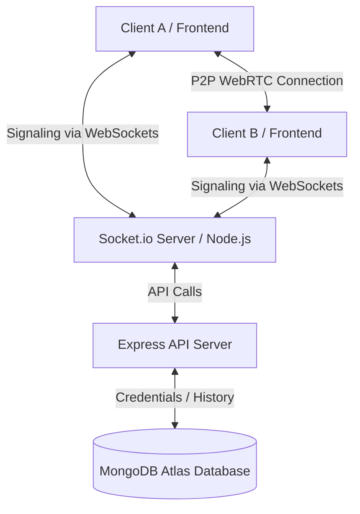

# 🌐 Apna Video Call (Zoom Clone)

A high-fidelity, real-time video conferencing platform built on a modern WebRTC architecture. It features interactive lobby entrances, screen-sharing, instant text chat, and a responsive glassmorphic dark-theme design.

---

## 🚀 Key Features

*   **Real-time Peer Connections**: Ultra-low latency video and audio streaming powered by **WebRTC** and **Socket.io**.
*   **Permissions Guard**: Strict camera & microphone permissions checks on lobby entry. Warns, guides, and re-prompts the user inline if access is blocked without requiring a page reload.
*   **Video Flicker Protection**: Checking refs prevent canvas reload flickering on state-driven re-renders.
*   **Screen Sharing**: Seamless switching between camera feeds and screen-share tracks using WebRTC track replacement.
*   **Meeting History Dashboard**: Keeps a chronological record of joined meeting codes linked to the logged-in user account.
*   **Instant Text Chat**: Direct message chat panel inside meeting rooms with dynamic badge notifications.
*   **Premium Theme**: Implemented a responsive space-dark theme using glassmorphism layouts, electric blue & cyan gradients, keyframe logo float animations, and tab focus glows.

---

## 🛠️ Technology Stack

| Layer | Technologies Used |
| :--- | :--- |
| **Frontend** | React, Vite, Material UI (MUI), Axios, React Router, Socket.io-client |
| **Backend** | Node.js, Express.js, MongoDB (Atlas), Mongoose, Socket.io |
| **Security** | Bcrypt (10 rounds password hashing), Cryptographic session token generation |
| **Real-Time** | WebRTC (RTCPeerConnection, STUN Servers), Web Sockets |

---

## 📊 System Architecture



---

## ⚙️ Installation & Configuration

### Prerequisites
*   [Node.js](https://nodejs.org/) (v16+ recommended)
*   [MongoDB Atlas](https://www.mongodb.com/cloud/atlas) account

### Setup Steps

1.  **Clone the Repository**:
    ```bash
    git clone https://github.com/sanjaynayak1224/Video_Conferencing_Platform.git
    cd Video_Conferencing_Platform
    ```

2.  **Configure Backend Environments**:
    Create a `.env` file in the `backend/` directory:
    ```env
    PORT=8080
    MONGO_URL=mongodb+srv://<username>:<password>@cluster.mongodb.net/apnavideocall
    ```

3.  **Run Backend Server**:
    ```bash
    cd backend
    npm install
    npm run dev
    ```

4.  **Run Frontend Client**:
    ```bash
    cd ../frontend
    npm install
    npm run dev
    ```
    Open your browser to the local development URL displayed in your terminal (typically `http://localhost:5173`).

---

## 🎨 Visual Upgrades Summary
*   **Unified Color Palette**: Adopted a premium tech Blue (`#0E71EB`) & Cyan (`#00d2ff`) gradient system.
*   **Glassmorphic Navbar**: Soft blurs (`backdrop-filter`) and thin borders overlaying the background.
*   **Centered Card Forms**: Completely centered layouts with responsive padding.
*   **Micro-interactions**: Scale translations on hover, active input glows, and float animations on mockups.
