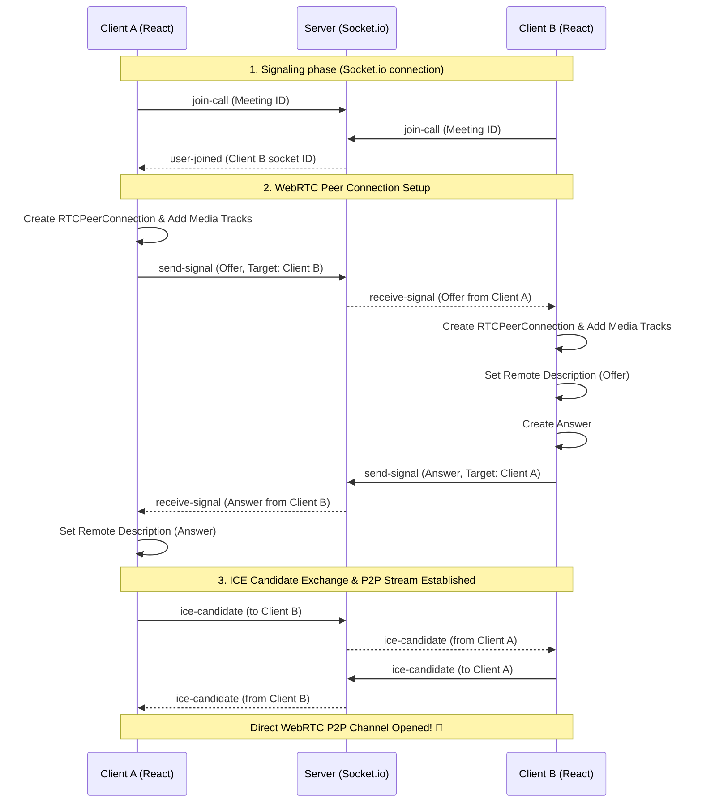

# 🌐 Apna Video Call (Zoom Clone)

<p align="center">
  
  
  
  
  
  
  
</p>

A premium, high-fidelity, real-time video conferencing platform built on a modern **WebRTC P2P mesh architecture**. Features an interactive pre-meeting lobby, seamless screen-sharing, instant text chat, and a stunning orientation-aware glassmorphic interface designed to offer a state-of-the-art virtual collaboration experience.

---

## 🌟 Core Features

*   **⚡ Ultra-Low Latency Streaming**: Native peer-to-peer audio & video transmission powered by WebRTC (`RTCPeerConnection`) with Socket.io signaling.
*   **🔄 Auto-Rejoin on Reload**: Routing built on `HashRouter` prevents "Page not found" 404 errors on dynamic reloads. If a user reloads the page while actively in an ongoing call, they are automatically reconnected to the room immediately, bypassing the lobby. When entering a room fresh, they are guided through the interactive Lobby page first to prevent unintended auto-joins.
*   **🔒 Permissions Guard Lobby**: Intelligently inspects microphone and camera hardware before entrance. Guides and re-prompts the user inline if permission is denied, avoiding messy page refreshes.
*   **🖥️ Narrated Screen Sharing & Mobile Modals**: One-click screen sharing with local microphone audio preserved. On mobile devices (iOS, iPadOS, Android) where native browser APIs do not support screen share, a premium glassmorphic modal is shown with a one-click button to copy the meeting invitation link.
*   **🎧 Dynamic Bluetooth Routing**: Real-time mid-call audio device redirection. Connecting/disconnecting Bluetooth headphones dynamically triggers a device state change check, routing running audio buffers and active HTML5 video track sinks to the system's new default playback output without requiring a page reload.
*   **📱 Horizontal Video Carousel**: Implemented a horizontal scrolling flex carousel with snapping for meetings with 2+ participants, ensuring the main layout remains locked and controls never scroll out of view.
*   **💬 In-Meet Chat Room**: Threaded messaging panel with dynamic notification badges (which automatically mute and reset while the chat panel is actively open) so you don't miss updates when focused elsewhere.
*   **✨ Space-Dark Glassmorphic Theme & iPad Layout Lock**: Designed with custom HSL-tailored gradients, subtle CSS micro-animations, and dynamic viewports (`100dvh`). iPad portrait/landscape screens (`>= 768px`) are locked to the side-by-side desktop layout with zero vertical scrolling or empty bottom gaps, while standard vertical layout stacking and scrolling are dynamically enabled only on mobile phone viewports (`< 600px`).


---

## 🛠️ Tech Stack & Architecture

| Layer | Technologies | Role |
| :--- | :--- | :--- |
| **Frontend** | React, Vite, Material UI (MUI), Axios | UI Components, State Management & Build Tool |
| **Backend** | Node.js, Express.js, MongoDB Atlas, Mongoose | REST API, Database Models & Core Web Server |
| **Real-Time** | WebRTC, Socket.io | Signaling & Peer-to-Peer Media Streams |
| **Security** | Bcrypt (10 rounds), JSON Web Tokens (JWT) | Password Hashing & Authenticated Session Routing |

### 📊 Signaling & P2P Media Flow

The diagram below details how clients register with the backend via WebSockets (Socket.io) to exchange WebRTC offer/answer session descriptions (SDP) and ICE candidates, establishing a direct peer-to-peer audio/video connection.



---

## ⚙️ Installation & Configuration

### Prerequisites
- [Node.js](https://nodejs.org/) (v18+ recommended)
- A [MongoDB Atlas](https://www.mongodb.com/cloud/atlas) cluster (or local MongoDB database instance)

### Quick Start Setup

1. **Clone the repository**:
   ```bash
   git clone https://github.com/sanjaynayak1224/Video_Conferencing_Platform.git
   cd Video_Conferencing_Platform
   ```

2. **Configure Backend Environment**:
   Create a `.env` file in the `/backend` folder:
   ```env
   PORT=8080
   MONGO_URL=mongodb+srv://<username>:<password>@cluster.mongodb.net/apnavideocall
   ```

3. **Install Dependencies & Start the Servers**:

   - **Start the Backend API Server**:
     ```bash
     cd backend
     npm install
     npm run dev
     ```

   - **Start the React Frontend Client**:
     ```bash
     cd ../frontend
     npm install
     npm run dev
     ```

4. **Access the application**:
   Open `http://localhost:5173` in your browser. Open multiple windows/tabs or join from another device to start video conferencing!

---

## 🎨 Visual Details & Layout Optimization

- **Self-view Mirroring & Positioning**: Built-in mirrored scaling (`transform: scaleX(-1)`) for local video inputs to look natural (remote views remain unmirrored). Positioned in the bottom-left corner. Adapts to **portrait aspect ratio (`9:16`)** on mobile phones to display the feed vertically.
- **Mobile Viewport Fix (`100dvh`)**: Avoids the classic mobile layout issue where address bars crop control buttons.
- **Locked Page Viewport & iPad-Specific Constraints**: The overall page container height is strictly set to `100dvh` with `overflow-y: hidden` on all desktop and tablet/iPad screen sizes. Responsive layouts are optimized to shift to vertical stacking only below the `600px` width breakpoint, preventing iPad portrait (768px wide) from triggering mobile viewports. This keeps the layout horizontal, fully visible, and non-scrollable (eliminating extra empty black borders at the bottom).
- **Horizontal Video Carousel & Snap Alignment**:
  - **1 User**: Centered, bounded 16:9 video frame (prevents video stretching and pixelation on large screens).
  - **2+ Users**: Arranged in a horizontal scrolling flex layout (`overflow-x: auto; scroll-snap-type: x mandatory;`) with cards snapping cleanly to the center as the user swipes. 
  - **Card Sizing**: Responsive card dimensions (width is `75vw` on desktop, `85vw` on mobile portrait, and `60vw` on mobile landscape) to match the screen orientation beautifully.

